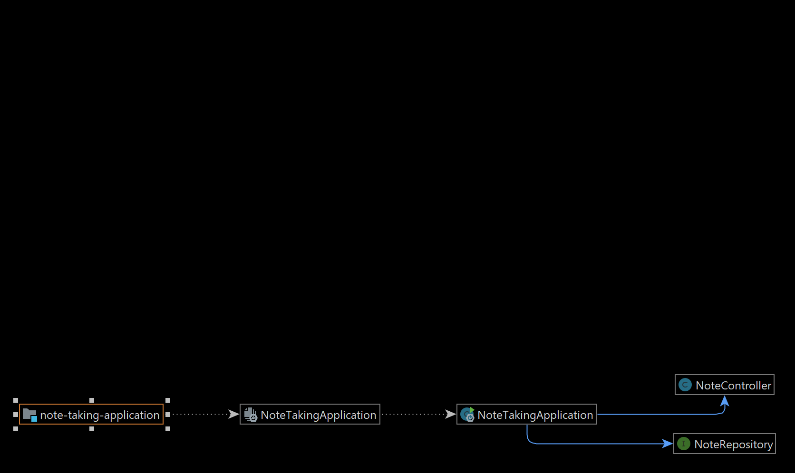
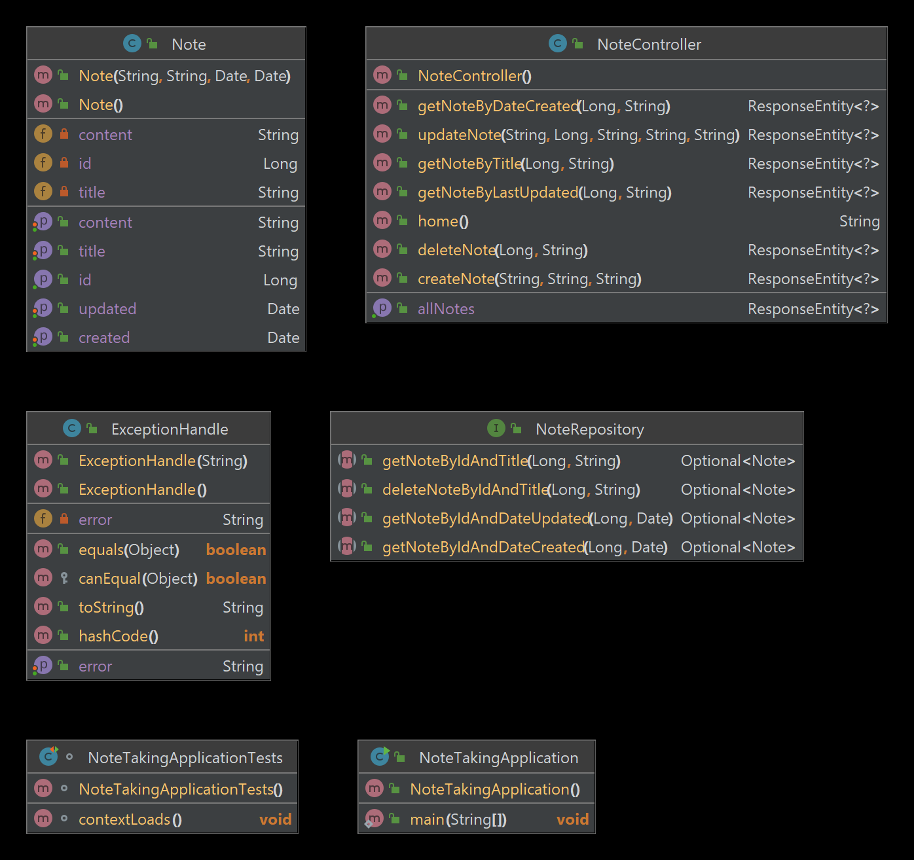
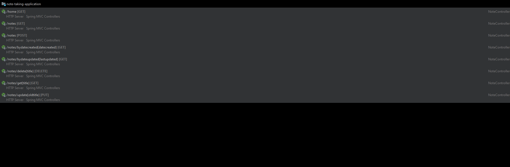

# Note-Taking application
## This project is made under the internship program arranged by CodeClause
# Author: Dinesh Dixit

### Flowchart:
 
### Diagram:
 

### Endpoints:
 

Working Methods:                                                               
1.Create Note                                                                                         
2.Get Note                                                                                                
3.Update Note                                                                                            
4.Delete Note

##### All endpoints are working and have checked with postman client.If you find any bug please contact me.

### Tools used:
IDE:IntelliJ Idea                                                                 
Technologies: Springboot-2.7.11,Java-17,Data-Jpa,MySql,Lombok                                                              
Client: Postman                                                   

### contact
Portfolio: http://mechatron.epizy.com

Linkedin: https://www.linkedin.com/in/dinesh-dixit

Github: https://github.com/Mechatron00
  
